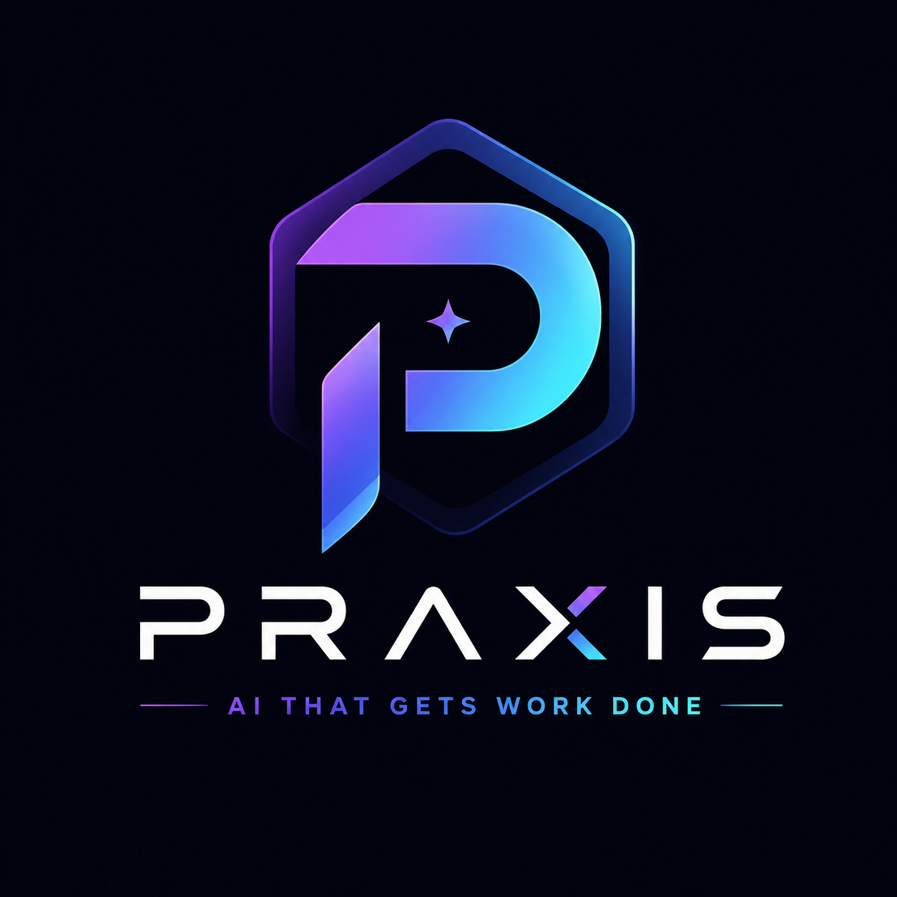
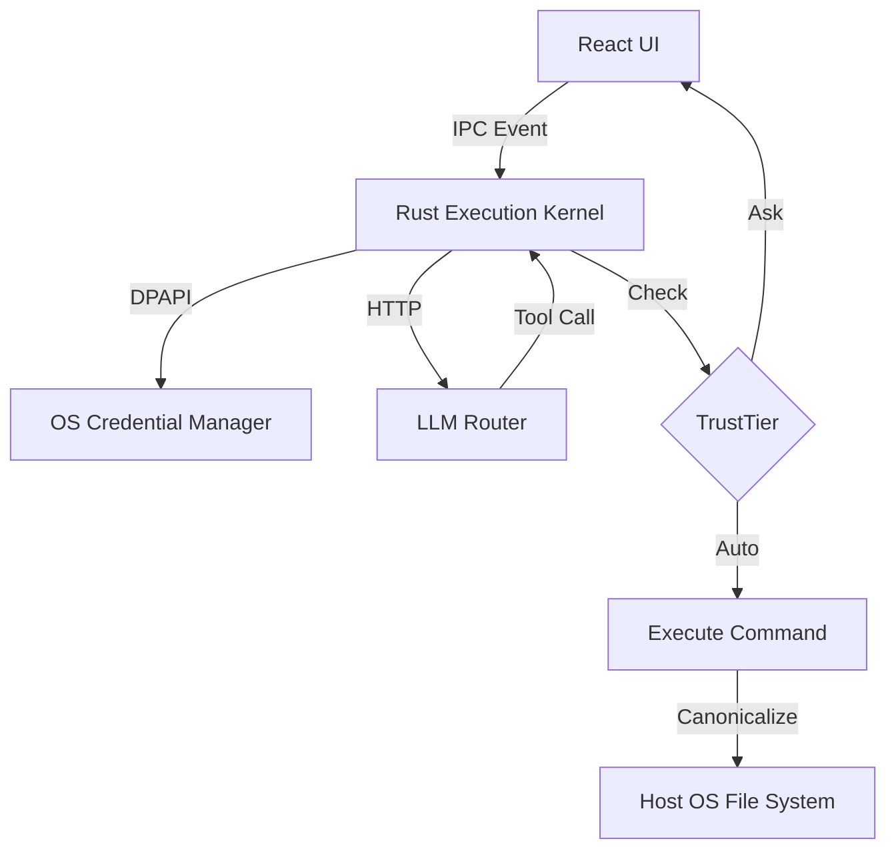

<div align="center">
  
  <h1>Praxis</h1>
  <p><strong>AI THAT GETS WORK DONE</strong></p>
  <p>A blazingly fast, natively secure Desktop AI coding environment built on Rust and Tauri.</p>

  <p>
    <a href="https://github.com/divyansh9704/praxis/releases"></a>
    <a href="https://github.com/divyansh9704/praxis/actions/workflows/ci.yml"></a>
    <a href="LICENSE"></a>
    
    
    
  </p>
</div>

<br />

> [!NOTE]  
> Praxis is currently in early release (`v1.0.0`). The core Rust/Tauri execution environment is stable, but features like native Anthropic integration and Ollama support are actively being developed.

---

## 📖 Introduction

**Praxis** is a desktop application that turns your computer into an autonomous coding environment. While other tools execute AI-generated commands loosely in the background or force you into a web browser, Praxis runs natively on your host machine wrapped in a strict, Rust-enforced security sandbox.

### Why Praxis Exists

We loved the idea of autonomous AI agents (like OpenHands or Claude Engineer), but hated the implementation. They either required complex Docker setups, stored our API keys in plain text, or blindly executed destructive commands (`rm -rf`) without confirmation. 

Praxis was built to solve the **Security vs. Autonomy** tradeoff. It gives the AI the power to build full-stack apps on your machine, but forces all mutative operations through a rigid, memory-safe `TrustTier` permission model.

---

## ⚡ Key Features

### ✅ Implemented
- **TrustTier Security Model**: Destructive shell commands (e.g., `npm install`, `del`) automatically trigger a secure, blocking React UI prompt before execution. Safe commands are auto-executed.
- **Workspace Isolation**: The Rust filesystem kernel statically resolves and canonicalizes all paths. Any AI attempt to traverse outside the explicitly designated project folder is violently rejected.
- **Hardware Credential Store**: API keys are saved directly into the Windows DPAPI / macOS Keychain. They are never written to disk in plain text.
- **Audit Logging**: Every single shell command executed by the AI is logged permanently to a local SQLite database (`praxis.db`), establishing a perfect cryptographic-style ledger.
- **"Quiet Luxury" UI**: A gorgeous, frameless, transparent-layered dashboard built without bloated CSS frameworks.

### 🚧 In Progress
- **Anthropic Native API**: Direct integration bypassing OpenRouter.
- **Audit Log UI**: A dedicated dashboard view to inspect the SQLite `actions` table.

### 📅 Planned
- **Ollama Support**: 100% offline local model inference.
- **Docker Integration**: Optional ephemeral sandboxing for execution.
- **Model Context Protocol (MCP)**: Native plugin support.

---

## 🧠 Architecture Overview

Praxis is built on a high-performance **Rust + React** hybrid architecture, using Tauri v2 as the IPC bridge.



*(See the `docs/` folder for deeper architectural deep-dives).*

---

## 🚀 Quick Start

### Installation
You can grab the latest standalone installer for Windows directly from the [Releases](https://github.com/divyansh9704/praxis/releases) page.

*(macOS and Linux builds are coming soon).*

### Development Setup
To build Praxis from source, you will need **Node.js 20+** and **Rust**.

```bash
git clone https://github.com/divyansh9704/praxis.git
cd praxis
npm install
npm run tauri dev
```

### Configuration
On first boot, Praxis will prompt you for an OpenRouter API key. This key is instantly injected into your OS Credential Manager. You will then select a "Workspace" folder (e.g., `C:\MyProject`). The AI cannot see or touch anything outside of this folder.

---

## ⚖️ Comparison

| Feature | Praxis | Cursor | OpenHands |
|---------|--------|--------|-----------|
| **Architecture** | Native Desktop (Rust) | Electron IDE | Python CLI/Docker |
| **Workspace Sandboxing** | ✅ Strict `std::fs` Path Locking | ❌ Full Host Access | ✅ Docker Native |
| **TrustTier Auth** | ✅ Rust IPC Gating | ❌ Auto-run | ❌ Binary Toggle |
| **Credential Storage** | ✅ Native OS Keychain | ❌ Plaintext / Env | ❌ Env File |
| **Memory Footprint** | ~50MB (Tauri) | ~800MB (Electron) | ~1GB+ (Python) |

---

## 🤝 Contributing

We welcome contributions! Please see our [Contributing Guidelines](CONTRIBUTING.md) and [Code of Conduct](CODE_OF_CONDUCT.md).

## 📄 License

This project is licensed under the **MIT License**. See the [LICENSE](LICENSE) file for details.

## 👤 Author

**Divyansh Sharma**  
[LinkedIn](https://www.linkedin.com/in/divyansh-sharma-a2b4a9237) | [GitHub](https://github.com/divyansh9704)
