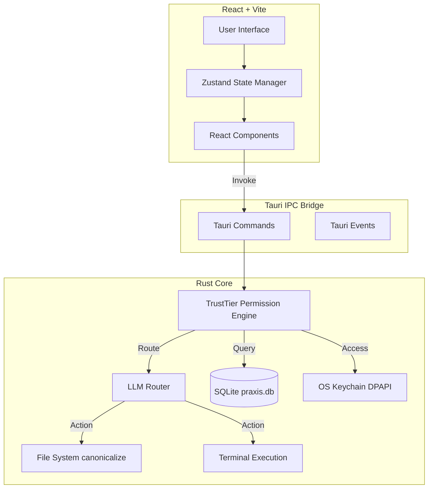

# System Architecture

Praxis is built on a hybrid architecture combining the high-performance memory safety of Rust with the dynamic UI capabilities of React and TypeScript, bound together by Tauri.

## 1. Frontend (React + TypeScript)
- Built with **Vite** for HMR and rapid builds.
- Styled with raw CSS to ensure maximum performance and maintainability without framework lock-in.
- State is managed via lightweight context and prop-drilling, avoiding bloated Redux stores for high-frequency chat updates.

## 2. Backend (Rust + Tauri)
- **Memory Safety**: The entire system logic is written in Rust, eliminating buffer overflows and memory leaks.
- **Multithreading**: Heavy LLM requests are spawned on Tokio async tasks so the UI never blocks.
- **IPC Protocol**: Commands are strongly typed across the boundary using `serde`.

## 3. Storage Layer
- **SQLite**: Local relational database (`praxis.db`) storing chat history, audit logs, and settings.
- **Keychain (`keyring`)**: Connects directly to the OS-native credential manager (e.g., Windows DPAPI) ensuring API keys are never stored on disk in plaintext.

## 4. Execution Sandbox
- The Rust backend implements strict path canonicalization. 
- LLM outputs attempting to utilize `std::fs` operations outside of the explicitly active `workspace` path are instantly rejected by the Rust kernel before the operation ever reaches the OS syscall level.
