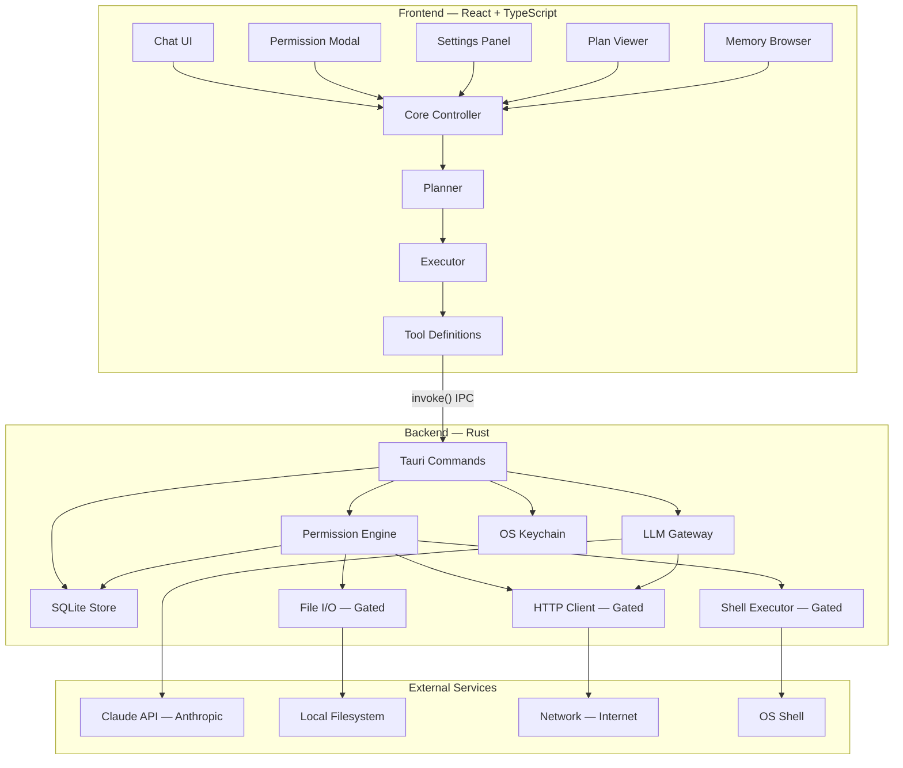
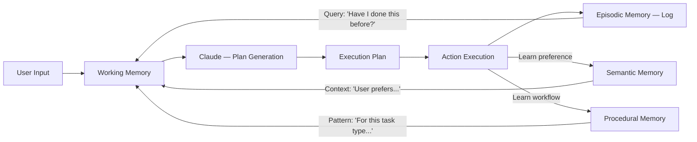
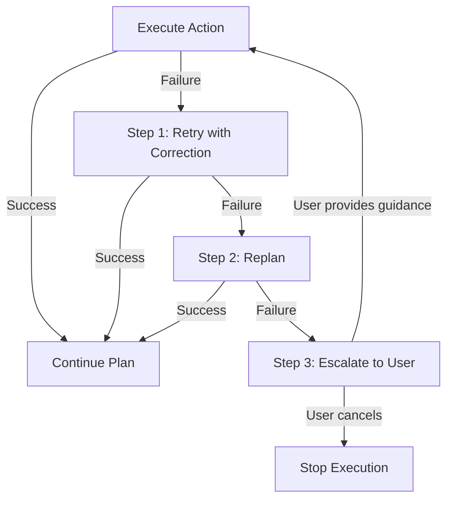

# Architecture

> **A detailed technical overview of Praxis's system design, permission model, memory taxonomy, and technology decisions.**

---

## System Overview

Praxis is a desktop AI agent built on the **Tauri 2** framework. It separates concerns into two distinct layers:

1. **Frontend (TypeScript/React)** — Handles all user interaction: chat UI, permission dialogs, settings, plan visualization, and memory browsing. The frontend never directly touches the filesystem, network, or shell. All side-effecting operations go through Tauri's `invoke()` IPC bridge.

2. **Backend (Rust)** — Owns all system access. Every file read/write, shell command, HTTP request, and database operation executes in Rust. The backend enforces permission rules *before* executing any action, making it impossible for the frontend (or a compromised LLM response) to bypass the trust system.

This split is not incidental — it is the core security architecture. The **Rust backend is the enforcement boundary**. The TypeScript frontend is a display layer with no privileged access.

---

## Architecture Diagram



### Data Flow

1. **User types a request** → Chat UI captures input
2. **Core Controller** sends the message to the **Planner** 
3. **Planner** calls the Rust backend via `invoke()` to send the conversation to **Claude**
4. **Claude returns a plan** with proposed tool calls (file operations, shell commands, web requests)
5. **Executor** iterates through each tool call and invokes the corresponding **Tauri Command**
6. **Permission Engine** checks each action against the user's trust rules
7. If **Guarded**: a permission modal appears in the frontend; execution blocks until approval
8. If **Trusted Session**: approved categories execute silently; others prompt
9. If **Always-Deny**: the action is rejected immediately with an explanation
10. **Results flow back** through `invoke()` to the frontend for display

---

## Permission Enforcement Architecture

The permission system is the most critical subsystem in Praxis. It operates on two layers:

### Layer 1: Rust Enforcement Boundary

This is the **hard security layer**. It runs in the Rust backend and cannot be bypassed by frontend code, LLM outputs, or prompt injections.

```rust
// Pseudocode — actual implementation in src-tauri/src/

#[tauri::command]
async fn execute_action(
    action: Action,
    permission_store: State<PermissionStore>,
    app_handle: AppHandle,
) -> Result<ActionResult, ActionError> {
    // Step 1: Check permission rules
    let decision = permission_store.check(&action);
    
    match decision {
        Decision::Allowed => {
            // Pre-approved by trust rule — execute silently
            execute(action).await
        }
        Decision::Denied => {
            // Always-Deny rule matched — reject immediately
            Err(ActionError::Denied(action.describe()))
        }
        Decision::NeedsApproval => {
            // Guarded mode — emit event to frontend, wait for response
            let approved = request_user_approval(&app_handle, &action).await;
            if approved {
                execute(action).await
            } else {
                Err(ActionError::UserDenied)
            }
        }
    }
}
```

**Key properties:**
- The `execute()` function is *only* reachable through the permission check
- There is no `invoke()` command that directly executes a shell command, writes a file, or makes an HTTP request without passing through `check()`
- Trust rules are read from SQLite — they cannot be modified by LLM outputs

### Layer 2: TypeScript Display Layer

This layer handles the *UX* of the permission system — showing the user what's being requested and capturing their decision.

```typescript
// Pseudocode — actual implementation in src/

async function handlePermissionRequest(request: PermissionRequest) {
  // Display a modal with:
  // - Action type (file write, shell command, HTTP request)
  // - Exact details (file path, command string, URL)
  // - Natural language description of what will happen
  // - Approve / Deny / Always-Allow / Always-Deny buttons
  
  const decision = await showPermissionModal(request);
  
  // Send decision back to Rust backend
  await invoke('respond_to_permission', { 
    requestId: request.id, 
    decision 
  });
}
```

**Key properties:**
- The frontend *displays* permissions but does not *enforce* them
- Even if the frontend is compromised (e.g., via a XSS vulnerability), the Rust backend will still block unapproved actions
- The modal provides "Always-Allow" and "Always-Deny" buttons that create persistent trust rules in SQLite

### Pattern for Adding New Commands

Every new Tauri command that performs a system-modifying action must follow this pattern:

1. **Define the action type** in the permission engine's action taxonomy
2. **Route through `check()`** before any side effect
3. **Provide a human-readable description** that the frontend can display in the permission modal
4. **Log the action and decision** to the action log in SQLite

```rust
// Adding a new "create_directory" command:

#[tauri::command]
async fn create_directory(
    path: String,
    permission_store: State<PermissionStore>,
    app_handle: AppHandle,
) -> Result<(), ActionError> {
    let action = Action::CreateDirectory { path: path.clone() };
    
    // This line is mandatory — no exceptions
    enforce_permission(&action, &permission_store, &app_handle).await?;
    
    // Only reachable if permission was granted
    std::fs::create_dir_all(&path)?;
    Ok(())
}
```

---

## Memory Taxonomy

Praxis organizes its memory into four categories, inspired by human cognitive science:

| Memory Type | Storage | Contents | Query Method | Retention |
|---|---|---|---|---|
| **Working Memory** | In-process (RAM) | Current conversation messages, active plan, pending tool calls | Direct access — always in context | Session-scoped. Cleared when the conversation ends. |
| **Episodic Memory** | SQLite — `actions` table | Historical record of actions taken: what was done, when, whether it succeeded, what the user approved/denied | SQL query by time range, action type, or keyword | Persistent. Grows over time. Queryable for "last time I did X" patterns. |
| **Semantic Memory** | SQLite — `preferences` table | User preferences and facts learned over time: "prefers dark mode", "uses Python 3.12", "project is a React app" | Semantic similarity search (future) / keyword match (current) | Persistent. Updated as new information is learned. |
| **Procedural Memory** | SQLite — `preferences` table | Learned workflows and patterns: "when organizing files, group by extension then by date", "when writing Python, use type hints" | Pattern matching against current task context | Persistent. Refined through repeated interactions. |

### Memory Flow



**Working Memory** is the AI's "attention" — what it's actively thinking about. It's populated with the current conversation, relevant episodic memories ("you organized your Downloads folder last week using this approach"), semantic context ("you prefer to keep media files separate from documents"), and procedural knowledge ("when sorting files, create subdirectories first, then move files").

---

## Replanning & Retry Policy

When an action fails, Praxis follows a 3-step escalation policy:

### Step 1: Automatic Retry with Correction

If an action fails due to a recoverable error (file not found, permission denied by OS, network timeout), the system:

1. Captures the error message and context
2. Sends the error back to Claude with the original plan
3. Asks Claude to generate a corrected action
4. Submits the corrected action through the normal permission flow

**Example:**
```
Plan: Write to ~/Documents/report.txt
Error: Directory ~/Documents does not exist
Correction: Create ~/Documents, then write report.txt
→ Both actions go through permission check
```

### Step 2: Replan

If the corrected action also fails, or if the error suggests the plan itself is flawed (not just a single step), the system:

1. Sends the full execution history (successes + failures) back to Claude
2. Asks for a completely new plan that avoids the failed approach
3. Presents the new plan to the user for approval before executing

**Example:**
```
Original plan: Install package via pip
Failure: pip not found
Retry: Use pip3 instead  
Failure: pip3 also not found
Replan: Check if Python is installed → suggest installing Python first
→ New plan shown to user for approval
```

### Step 3: Escalate to User

If replanning also fails (after one replan attempt), the system:

1. Stops execution
2. Presents a clear summary of what was attempted, what failed, and why
3. Asks the user for guidance: "I tried two approaches and both failed. Here's what happened — how would you like me to proceed?"

**This is the safety valve.** The system never enters an infinite retry loop, never silently gives up, and never tries increasingly desperate actions without human oversight.



---

## Technology Decisions

| Technology | Choice | Rationale |
|---|---|---|
| **Desktop Framework** | Tauri 2 | Single binary output. Native performance. Rust backend provides memory safety and a hard security boundary. ~10MB binary vs. ~200MB for Electron. No bundled Chromium — uses the system webview. |
| **Frontend** | React 19 + TypeScript | Mature ecosystem, strong typing, excellent developer tooling. Component model maps naturally to the UI's modal/panel architecture. |
| **Build Tool** | Vite 7 | Fast HMR for development. Clean ESM output. First-class TypeScript and React support. |
| **Backend Language** | Rust | Memory safety without garbage collection. Strong type system catches errors at compile time. Tauri's native language. Permission enforcement in Rust means no runtime bypass is possible. |
| **Database** | SQLite | Zero-config embedded database. Single file. No server process. Perfect for local-first applications. Proven reliability (used in every smartphone OS, every browser, and most desktop applications). |
| **LLM Provider** | Claude (Anthropic) | Best-in-class tool-use capabilities. Structured output support. Strong instruction following. Reasonable pricing for individual users. |
| **Secrets Storage** | OS Keychain | Windows Credential Manager / macOS Keychain / Linux Secret Service. Industry-standard secure storage. Never write API keys to disk in plaintext — this is non-negotiable. |
| **IPC** | Tauri `invoke()` | Type-safe bridge between frontend and backend. Serialized via `serde`. Each command is explicitly registered — no arbitrary code execution across the boundary. |

---

## Security Properties

| Property | Guarantee |
|---|---|
| **No ambient authority** | The frontend has no direct access to the filesystem, network, or shell. All access is mediated by Rust commands. |
| **Permission before action** | Every system-modifying command passes through the permission engine before execution. |
| **Audit trail** | Every action (approved, denied, or failed) is logged to SQLite with timestamps and context. |
| **Secret isolation** | API keys are stored in the OS keychain. They are read into memory for API calls and never serialized to disk or logs. |
| **No eval** | Neither the frontend nor the backend uses `eval()`, `Function()`, or equivalent dynamic code execution on LLM outputs. |
| **CSP** | Content Security Policy headers restrict the webview's ability to load external resources. |

---

<p align="center">
  <em>Architecture is policy. Praxis's architecture enforces that no action modifies your system without your knowledge.</em>
</p>
