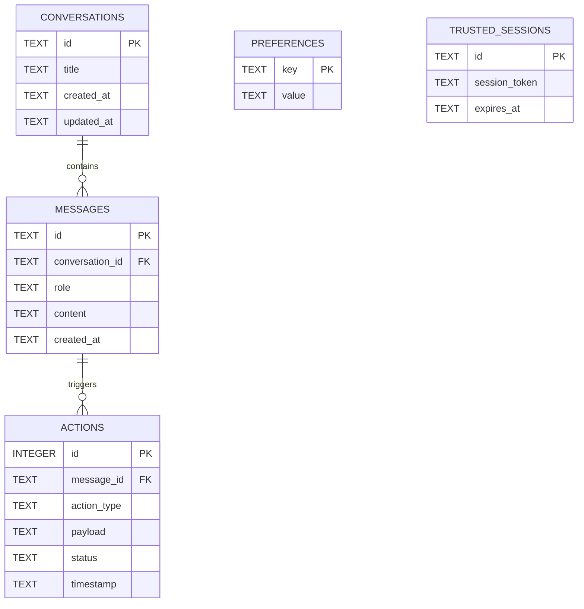

# Database Architecture

Praxis uses **SQLite** for robust, high-performance, and entirely local data persistence. The database file (`praxis.db`) is stored in the application's native `AppData` directory (e.g., `%APPDATA%\com.praxis.app` on Windows).

## Entity Relationship Diagram

## Audit Logging (`actions` table)
One of the most critical tables in `praxis.db` is the `actions` table.
Because the LLM operates semi-autonomously, every tool call it makes is logged here.
- **`action_type`**: e.g., `execute_command`, `write_file`
- **`payload`**: The raw JSON payload (e.g., the exact bash command string)
- **`status`**: `pending`, `approved`, `rejected`, `failed`, `success`

This ensures that even if you walk away from your computer, you have a permanent, queryable ledger of exactly what commands the AI ran, when it ran them, and what the outcome was.
