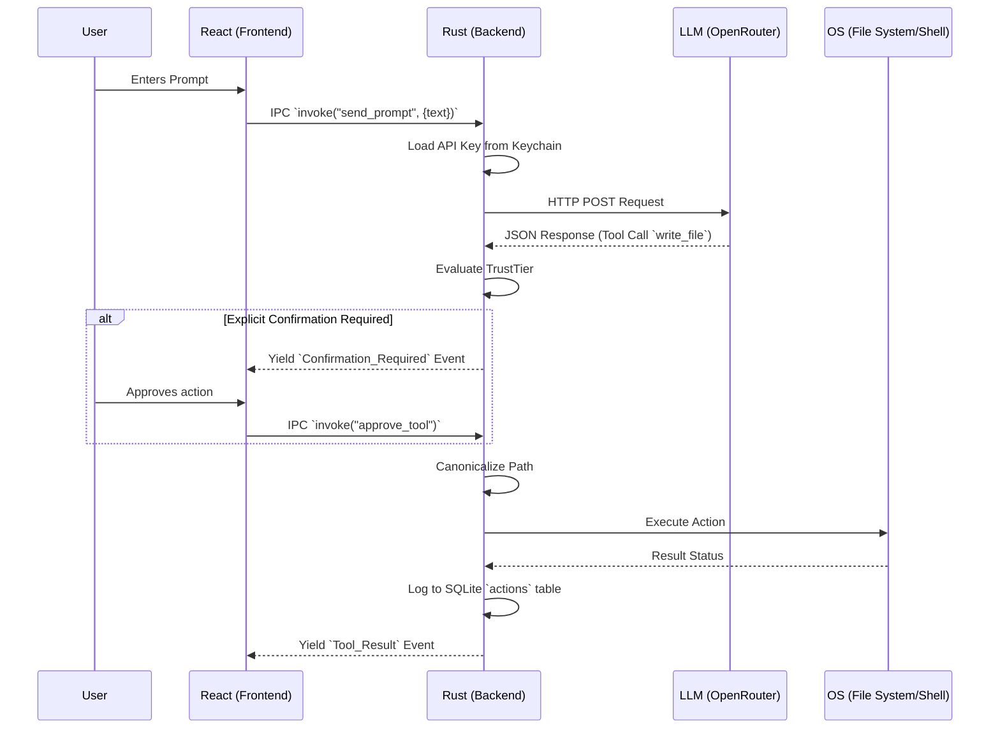

# Execution Flow

This document details the exact lifecycle of a user prompt inside Praxis, demonstrating the round-trip from the React frontend to the LLM via the Rust backend, and back.

## Step-by-Step Breakdown

1. **User Input**: The user types a message in the React UI.
2. **IPC Dispatch**: The frontend calls `invoke("send_prompt", { text: ... })`.
3. **Rust Threading**: Tauri spawns an asynchronous Tokio task so the main thread isn't blocked.
4. **Credential Fetch**: Rust queries the OS DPAPI for the necessary API keys.
5. **Network Request**: Rust makes a `reqwest` HTTP call to the OpenRouter/LLM provider.
6. **Tool Processing**: If the LLM requests a tool call (e.g., executing a terminal command), Rust parses the JSON.
7. **Trust Validation**: Rust evaluates the command against the user's `TrustTier`. If confirmation is required, it yields to the frontend and halts execution until the user approves.
8. **Execution**: The command is run safely within the canonicalized workspace bounds.
9. **Audit**: The operation is permanently recorded in `praxis.db`.
10. **Feedback Loop**: The result is sent back to the LLM to continue the loop or return a final text response to the user.
