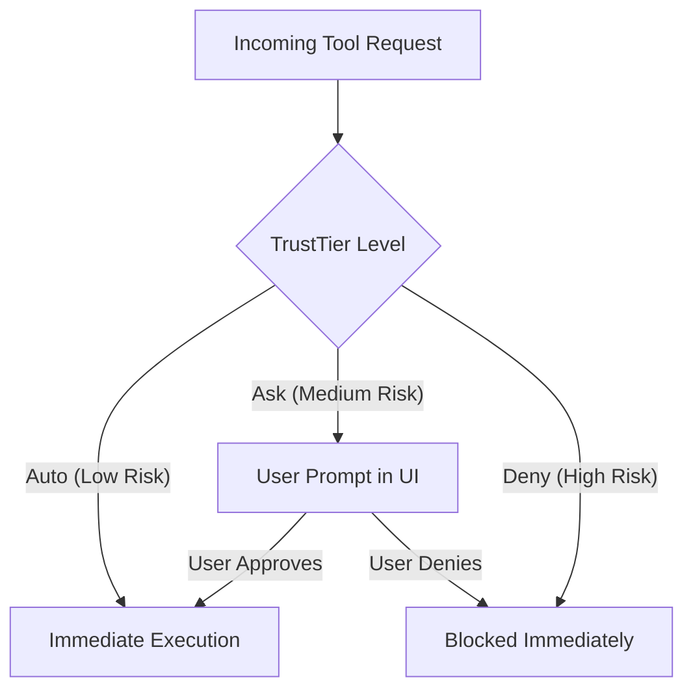

# TrustTier Permission Engine

The `TrustTier` model is the core security abstraction in Praxis. Because autonomous agents are granted the capability to modify your local filesystem and run shell commands, a rigid, deterministic authorization layer is required.

## The Three Tiers

### 1. Auto
Operations that are generally safe and non-destructive.
- Example: Reading a file (`view_file`), listing directories, fetching documentation.
- The Rust backend executes these immediately without bothering the user.

### 2. Ask (Default for mutations)
Operations that modify state or execute arbitrary code.
- Example: Writing to a file (`write_to_file`), executing a terminal command (`run_command`), making a network request.
- The Rust backend pauses the asynchronous execution thread, emits a `Confirmation_Required` event to the React frontend, and blocks until the user explicitly clicks "Approve" or "Reject".

### 3. Deny
Globally blacklisted operations that the AI is never allowed to perform under any circumstances.
- Example: Deleting the `.git` folder, modifying OS root directories (`C:\Windows`, `/etc`), attempting to read the SQLite `praxis.db` file itself.

## Future Implementation Status

Currently, the UI allows global modification of these tiers, but in a future update (🚧 In Progress), TrustTier will support granular per-workspace overrides (e.g., "Always allow `npm test` in the `frontend` folder, but Ask for everything else").
